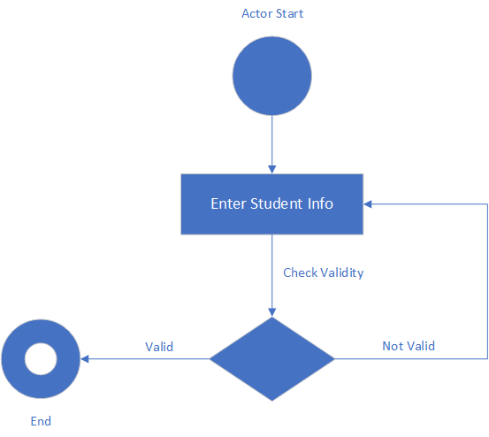
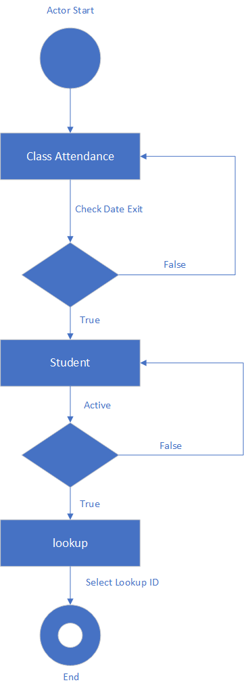
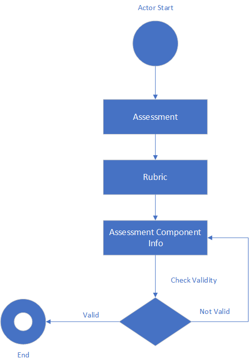
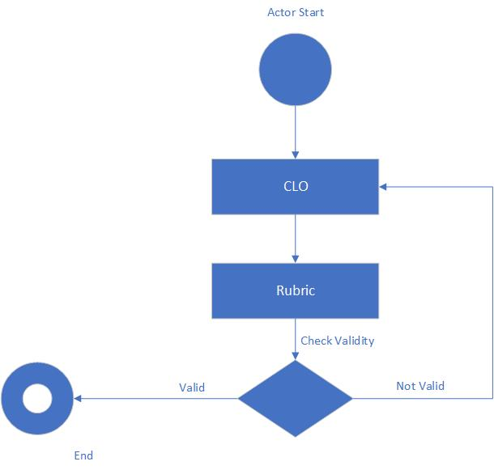
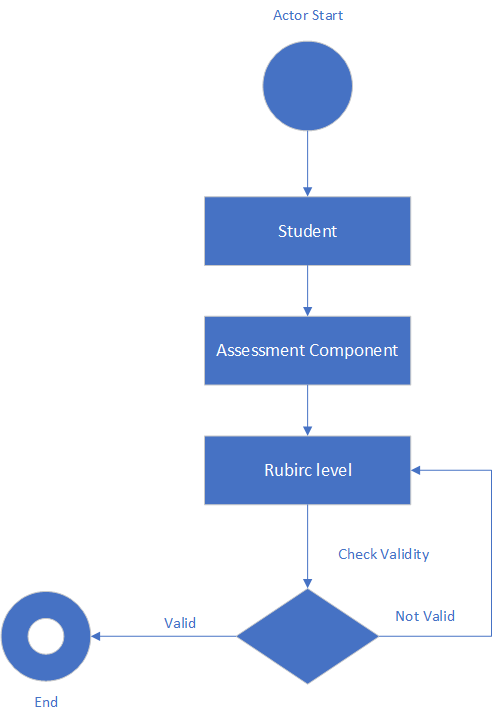

# Outcome Based Education Management System

# Introduction

## Description

Outcome-Based Education (OBE) is a learner-centered educational
philosophy that prioritizes the learning outcomes that students should
achieve. It aims to align the curriculum with the needs of the industry
and society, ensuring that graduates possess the necessary knowledge,
skills, and attitudes to excel in their chosen profession. OBE is a
holistic approach to education that emphasizes the importance of
measurable learning outcomes, as opposed to mere content delivery.

This project is based on the principles of Outcome-Based Education,
where a rubric-based assessment evaluation database system was developed
to measure and evaluate student learning outcomes. The system manages
student data, attendance records, assessment and component records,
rubrics and their levels, and CLO details. The database schema, table
relationships, and business rules were carefully designed and
implemented to align with the principles of OBE.

The system offers a comprehensive approach to evaluating student
learning outcomes, enabling educators to assess student progress,
identify areas for improvement, and tailor teaching methods to improve
student performance. By adopting an OBE philosophy, this project ensures
that graduates possess the skills and knowledge required to excel in
their chosen profession, aligning with the needs of the industry and
society.

In conclusion, this project highlights the importance of Outcome-Based
Education in ensuring that graduates possess the necessary skills and
knowledge to succeed in their chosen field. The rubric-based assessment
evaluation database system developed in this project is an effective
tool for measuring and evaluating student learning outcomes and aligns
with the principles of OBE.

## Motivation

The philosophy of Outcome-Based Education (OBE) prioritizes the learning
outcomes that students should achieve, ensuring that graduates possess
the necessary skills and knowledge required to excel in their chosen
profession. This project highlights the significance of OBE and its
relevance to the current education system. By implementing a
rubric-based assessment evaluation database system, this project offers
an effective approach to evaluating student learning outcomes, enabling
educators to tailor teaching methods and identify areas for improvement.
The adoption of an OBE philosophy in education is crucial in preparing
graduates for the challenges of the modern world, and this project
serves as a motivation for educators to embrace this approach to enhance
the quality of education and produce competent professionals.

## Target Audience

The target audience for this project is educators, curriculum designers,
and educational institutions seeking to improve the quality of education
and align the curriculum with the needs of the industry and society. The
rubric-based assessment evaluation database system developed in this
project offers an effective tool for measuring and evaluating student
learning outcomes, enabling educators to assess student progress,
identify areas for improvement, and tailor teaching methods to enhance
student performance. The project's focus on Outcome-Based Education
(OBE) philosophy also appeals to curriculum designers and educational
institutions looking to adopt a learner-centered approach to education,
ensuring that graduates possess the necessary skills and knowledge to
succeed in their chosen field. Overall, this project targets individuals
and organizations committed to improving the quality of education and
preparing graduates for the challenges of the modern world.

# Operational Details

This system is specifically tailored for a solo user, allowing for
seamless and efficient management of various academic tasks. With this
system, the instructor gains access to a range of features that enable
them to manage student data, assessments, assessment components,
rubrics, course learning outcomes (CLOs), and student attendance. These
features provide a comprehensive approach to academic management,
allowing instructors to streamline tasks and improve efficiency. The
system is designed to simplify the academic management process, enabling
instructors to focus on what matters most - ensuring students receive
the best possible education.

## Technology Stack

The system is designed, developed, and tested in a desktop application.
The system used the following language, packages, and an Integrated
development environment.\

     C \# (7.3)
------------------------------- ---------------------------------------
  IDE                                        Microsoft Visual Studio 2022
  Package                               iTextSharp (5.5.13.3)
  Framework                                        .Net framework (4.7.2)
  UI (user interface) framework     Windows Presentation Foundation (WPF)
                                  

  :Details of technology used in the system. The version number is
  enclosed in brackets

## System Requirement

    Multicore Intel® or AMD processor (2 GHz or faster processor with SSE 4.2 or later) with 64-bit support
-------------------- ---------------------------------------------------------------------------------------------------------
  Operating system                                                                                                     Windows 8
  RAM                                                                                                                       4 GB
  Monitor resolution                                                                                   1280 x 800 display at 100
  Hard disk space                                                                              1 GB of available hard-disk space
                       

To run Outcome Based Education Management System, your computer must meet the minimum technical specifications outlined below. For optimum performance, use recommended system specifications.

# Database Design

Type Here


## Student

The student relation is responsible for storing information related to
students, such as their names, contact details, and registration number.
The table acts as a central repository for student data, which can be
accessed by other tables in the database for various academic management
tasks.

## Lookup

The lookup relation is utilized to retrieve data from a reference table,
where specific values are stored as strings for given foreign keys. The
lookup function is used to obtain the scalar equivalent of these foreign
keys, facilitating the retrieval of relevant information from the
database.

## Class Attendance

The class attendance relation is used to record attendance data for each
student in a particular date.

## Student Attendance

The student attendance relation is used to track and manage student
attendance data for each class attendance.

## CLO

CLO stands for Course Learning Outcomes. The CLO relation is used to
store information related to the specific learning outcomes that are
expected to be achieved by students upon completing a particular course.

## Rubric

Rubrics are used to evaluate student performance against specific
criteria related to a particular assignment.

## Rubric Level

Rrubric levels are used to define the different levels of performance
associated with each criterion in a rubric.

## Assessment

Assessments are used to evaluate student learning and progress towards
specific learning outcomes.

## Assessment Component

Assessment questions/component are used to measure specific aspects of
student learning related to a particular learning outcome. The
assessment question relation stores information related to the specific
questions used in an assessment

## Student Result

Student results are calculated based on their rubric level, assessment
component, and student ID. The system uses this information to generate
a comprehensive overview of each student's progress towards achieving
specific learning outcomes.

# Activity Diagram

Activity diagrams are a visual representation of the flow of activities
and actions within a system. They are commonly used in software
development to help illustrate the steps and interactions involved in a
particular process or functionality. By mapping out the activities and
their relationships, activity diagrams can aid in the design,
implementation, and testing phases of software development.

## Student Management



## Attendance Management




## Assessment Management


## Assessment Component Management



## Rubric Management



## Rubric Level Management


## CLO Management


## Student Result Management




# Graphical User Interface


## Student Management

### Edit and Delete Student


### Update and Add Student


## Attendance Management

### Mark Attendance


### View Attendance


### Update Attendance


## Assessment Management

Type Here


## Assessment Component Management


## Rubric Management

Type Here


## Rubric Level Management


## CLO Management


## Student Result Management


# Generated Reports

## Result CLO Wise

```sql
SELECT CONCAT(Max(S.FirstName),' ',Max(S.LastName))AS \[StudentName\],
S.RegistrationNumber, A.Title AS Assignment,A.TotalMarks,SUM((CAST
(RL.MeasurementLevel AS float)/ML.MaxLevel)\*AC.TotalMarks) AS
\[ObtainedMarks\], C.Name AS \[CLOName\] FROM Student S JOIN
StudentResult SR ON SR.StudentId=S.Id JOIN AssessmentComponent AC ON
AC.Id=SR.AssessmentComponentId JOIN RubricLevel RL ON
RL.Id=SR.RubricMeasurementId JOIN Assessment A ON A.Id=AC.AssessmentId
JOIN (SELECT RL1.RubricId,MAX(RL1.MeasurementLevel) AS MaxLevel FROM
RubricLevel RL1 GROUP BY RubricId) AS ML ON ML.RubricId=AC.RubricId JOIN
Rubric R ON R.Id=AC.RubricId JOIN Clo C ON C.Id=R.CloId WHERE C.Id=2
GROUP BY S.RegistrationNumber,A.Title,A.TotalMarks,C.Name ORDER BY
C.Name ASC;
```

## Class Attendance

````sql
SELECT CONCAT(S.FirstName,' ',S.LastName)AS Name,
S.RegistrationNumber,L.Name FROM Student S JOIN StudentAttendance ST ON
S.Id=ST.StudentId JOIN ClassAttendance C ON C.Id=ST.AttendanceId JOIN
Lookup L ON L.LookupId=ST.AttendanceStatus WHERE
L.Category='ATTENDANCE_STATUS' AND C.AttendanceDate='2023-03-10
00:00:00.000'
````

## Student Fail CLO

```sql
SELECT CONCAT(Max(S.FirstName),' ',Max(S.LastName))AS \[StudentName\],
S.RegistrationNumber,A.Title AS Assignment,A.TotalMarks, SUM((CAST
(RL.MeasurementLevel AS float)/ML.MaxLevel) \*AC.TotalMarks) AS
\[ObtainedMarks\], C.Name AS \[CLOName\] FROM Student S JOIN
StudentResult SR ON SR.StudentId=S.Id JOIN AssessmentComponent AC ON
AC.Id=SR.AssessmentComponentId JOIN RubricLevel RL ON
RL.Id=SR.RubricMeasurementId JOIN Assessment A ON A.Id=AC.AssessmentId
JOIN (SELECT RL1.RubricId,MAX(RL1.MeasurementLevel) AS MaxLevel FROM
RubricLevel RL1 GROUP BY RubricId) AS ML ON ML.RubricId=AC.RubricId JOIN
Rubric R ON R.Id=AC.RubricId JOIN Clo C ON C.Id=R.CloId GROUP BY
S.RegistrationNumber,A.Title,A.TotalMarks,C.Name HAVING ((SUM((CAST
(RL.MeasurementLevel AS float)/ML.MaxLevel)\*
AC.TotalMarks))/A.TotalMarks)\*100\<=33 ORDER BY C.Name ASC
```

## Result Asssessment Wise

```sql
SELECT CONCAT(Max(S.FirstName),' ',Max(S.LastName))AS \[StudentName\],
S.RegistrationNumber,A.Title AS Assignment,A.TotalMarks, SUM((CAST
(RL.MeasurementLevel AS float)/ML.MaxLevel)\*AC.TotalMarks) AS
\[ObtainedMarks\] FROM Student S JOIN StudentResult SR ON
SR.StudentId=S.Id JOIN AssessmentComponent AC ON
AC.Id=SR.AssessmentComponentId JOIN RubricLevel RL ON
RL.Id=SR.RubricMeasurementId JOIN Assessment A ON A.Id=AC.AssessmentId
JOIN (SELECT RL1.RubricId,MAX(RL1.MeasurementLevel) AS MaxLevel FROM
RubricLevel RL1 GROUP BY RubricId) AS ML ON ML.RubricId=AC.RubricId JOIN
Rubric R ON R.Id=AC.RubricId JOIN Clo C ON C.Id=R.CloId WHERE A.Id=2
GROUP BY S.RegistrationNumber,A.Title,A.TotalMarks ORDER BY A.Title ASC
```

## Result Top 10 Student

```sql
SELECT TOP 10 CONCAT(Max(S.FirstName),' ',Max(S.LastName)) AS
\[StudentName\], S.RegistrationNumber,A.Title AS
Assignment,A.TotalMarks, SUM((CAST (RL.MeasurementLevel AS
float)/ML.MaxLevel)\* AC.TotalMarks) AS \[Obtained Marks\] FROM Student
S JOIN StudentResult SR ON SR.StudentId=S.Id JOIN AssessmentComponent AC
ON AC.Id=SR.AssessmentComponentId JOIN RubricLevel RL ON
RL.Id=SR.RubricMeasurementId JOIN Assessment A ON A.Id=AC.AssessmentId
JOIN (SELECT RL1.RubricId,MAX(RL1.MeasurementLevel) AS MaxLevel FROM
RubricLevel RL1 GROUP BY RubricId) AS ML ON ML.RubricId =AC.RubricId
GROUP BY S.RegistrationNumber,A.Title,A.TotalMarks ORDER BY \[Obtained
Marks\] DESC
```

## Result Question Wise

```sql
SELECT CONCAT(Max(S.FirstName),' ',Max(S.LastName))AS \[StudentName\],
S.RegistrationNumber,A.Title AS Assignment,AC.TotalMarks, SUM((CAST
(RL.MeasurementLevel AS float)/ML.MaxLevel)\* AC.TotalMarks) AS
\[ObtainedMarks\] ,AC.Name AS QuestionName FROM Student S JOIN
StudentResult SR ON SR.StudentId=S.Id JOIN AssessmentComponent AC ON
AC.Id=SR.AssessmentComponentId JOIN RubricLevel RL ON
RL.Id=SR.RubricMeasurementId JOIN Assessment A ON A.Id=AC.AssessmentId
JOIN (SELECT RL1.RubricId,MAX(RL1.MeasurementLevel) AS MaxLevel FROM
RubricLevel RL1 GROUP BY RubricId) AS ML ON ML.RubricId =AC.RubricId
JOIN Rubric R ON R.Id=AC.RubricId JOIN Clo C ON C.Id=R.CloId WHERE
AC.Id=2 GROUP BY S.RegistrationNumber,A.Title,AC.TotalMarks,AC.Name
ORDER BY AC.Name ASC
```

## Specfic Student Result 

```sql
SELECT CONCAT(Max(S.FirstName),' ',Max(S.LastName))AS \[StudentName\],
A.Title AS Assignment,SUM((CAST (RL.MeasurementLevel AS
float)/ML.MaxLevel) \*AC.TotalMarks) AS \[Obtained Marks\],A.TotalMarks
FROM Student S JOIN StudentResult SR ON SR.StudentId=S.Id JOIN
AssessmentComponent AC ON AC.Id=SR.AssessmentComponentId JOIN
RubricLevel RL ON RL.Id=SR.RubricMeasurementId JOIN Assessment A ON
A.Id=AC.AssessmentId JOIN (SELECT RL1.RubricId,MAX(RL1.MeasurementLevel)
AS MaxLevel FROM RubricLevel RL1 GROUP BY RubricId) AS ML ON
ML.RubricId= AC.RubricId WHERE S.Id=24 GROUP BY
S.RegistrationNumber,A.Title,A.TotalMarks ORDER BY S.RegistrationNumber
ASC
```

## Specfic Student Attendance 

```sql
SELECT CONVERT(date, C.AttendanceDate, 101) AS Date ,L.Name FROM Student
S JOIN StudentAttendance ST ON S.Id=ST.StudentId JOIN ClassAttendance C
ON C.Id=ST.AttendanceId JOIN Lookup L ON L.LookupId=ST.AttendanceStatus
WHERE S.Id=29 ORDER BY DATE DESC
```

# Testing

Throughout my development process, I conducted testing at every stage
with each commit, ensuring that any bugs were identified and addressed
before they became significant issues. This approach allowed me to
tackle and resolve minor issues, preventing them from snowballing into
major problems.

During the testing phase of the Outcome Based Education Management
System application, the primary challenge was the lack of a specific
format for generating PDF reports. However, I made every effort to
create reports that were clear and readable for instructors, despite the
absence of a prescribed format. The rigorous testing process I employed
during development ensured that the Outcome Based Education Management
System application was robust and reliable, providing instructors with
accurate and useful information to support student success.

# Limitations

One of the limitations of the system is that it is designed for a single
class, single course scenario, and cannot be easily scaled to
accommodate multiple classes or courses. Additionally, the system's user
interface is currently limited to desktop platforms and does not support
mobile devices. The system's reporting functionality is also limited to
generating PDF reports without any formatting options. These limitations
may restrict the system's usage in certain scenarios and may require
additional development efforts to address them.

# Future Work

To address the limitations of the current system, future development
efforts will focus on implementing a more scalable architecture based on
the principles of Object-Oriented Programming (OOP). This will involve
separating the system into distinct layers, including a User Interface
(UI) layer, Business Logic (BL) layer, and Data Access Layer (DAL).
Additionally, efforts will be made to enhance the system's reporting
functionality by introducing formatting options for the generated PDF
reports. Finally, the system will be optimized for use on mobile devices
to provide greater flexibility in accessing and using the system. These
improvements will allow the system to be used in a wider range of
scenarios and provide a more user-friendly experience for instructors
and students alike.

# Collaboration

The successful completion of this project was made possible thanks to
the invaluable guidance of our supervisors, Mr. Nouman Babar and Mr.
Samyan Wahla, as well as the support of my friends who were always
available to discuss and troubleshoot any conceptual issues.

# Conclusion

The design and implementation of the rubric-based assessment evaluation
system has been successfully accomplished. The project has demonstrated
the use of Outcome-Based Education in the development of a database
system. The system provides a user-friendly interface to manage student
data, attendance records, assessment and assessment component records,
rubrics and their levels, and CLO details. The testing and debugging
phase ensured that the system is free of errors and meets the
requirements specified in the project brief. The limitations of the
system were also discussed, and future work was proposed to improve the
system's functionality. The successful completion of this project would
not have been possible without the guidance of our supervisors and the
support of our colleagues, and it has provided valuable insights into
database management systems and their applications in education sector.
